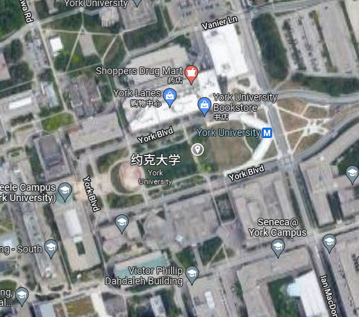

This project is based on the map of York University.
In this project, four models that represent four stores will be shown.
I setup the camera location in the middle of YorkUniversity as a test. 
   
Then you will see the direction of different stores.
The model will rescale or rota.
All the values are under the function staticLoadPlaces of script.js

And also, there is a button on the top of the screen.
When you click the button, a car model will be created in your real location.
It can be used to record where you park.